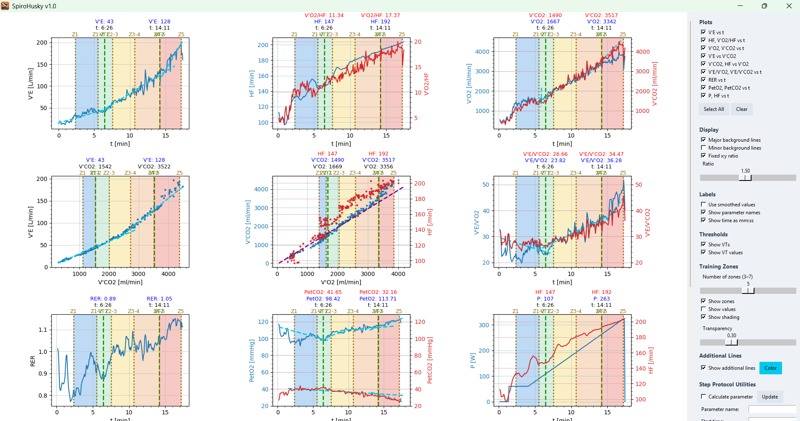
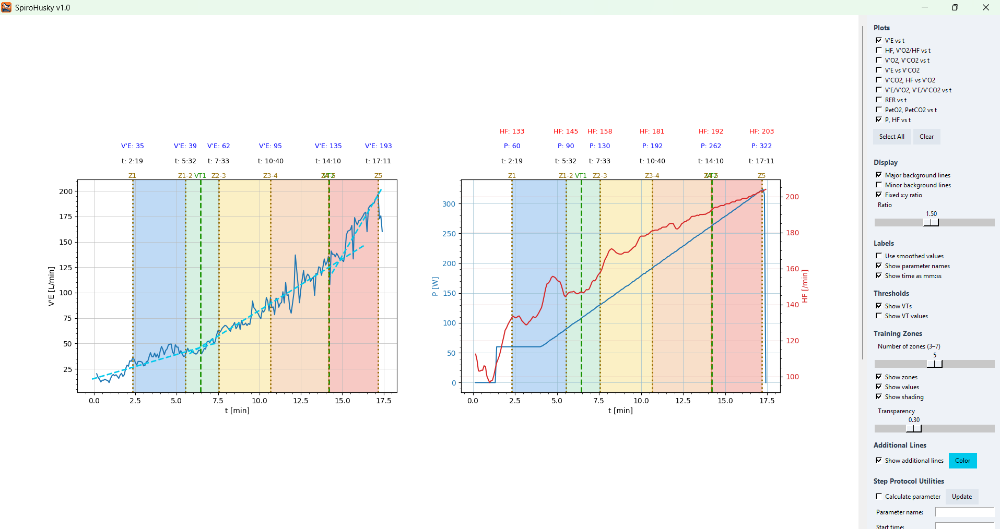
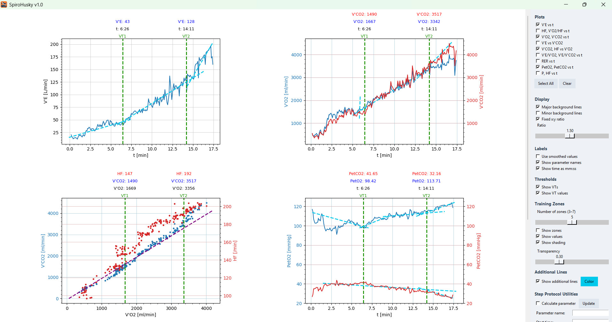

## SpiroHusky

An interactive toolkit for analyzing CPET (cardiopulmonary exercise testing) data.


Features:
- Interactive plotting of physiological signals
- Draggable lines for ventilatory thresholds and training zones
- Custom draggable lines for flexible analysis
- Support for MetaLyzer XML input files
- Import/export of sessions as `.spiro` files (compressed archive)  
- Export plots as PDF or PNG  

## Preview

<p align="center">
  
  
  
</p>

## Getting Started

### Use the comiled .exe File (recommended for non-programmers)

Download the latest release for your operating system from the releases section. Make sure that the .exe file has the files spiroHuskyConfig.yml and spiroHuskyIcon.ico in the same folder. 

### Run from source

```bash
pip install -r requirements.txt
python main.py
```

## How to build

For windows I compiled it with 

```bash
pyinstaller --onefile --windowed --name "SpiroHusky" --hidden-import=matplotlib.backends.backend_tkagg --hidden-import=PIL._tkinter_finder --hidden-import=tkcolorpicker --hidden-import=yaml --icon=spiroHuskyIcon.ico --add-data "spiroHuskyIcon.ico;." main.py
```

When running it, make sure it has the icon and the config file in the same folder.

## Disclaimer

This software is provided for research and educational purposes only.
It is not intended for medical diagnosis or clinical use.

## Dependencies

This project uses the following open-source libraries:

- numpy (BSD License)
- matplotlib (PSF License)
- Pillow (HPND License)
- tkinter (Python Standard Library)
- tkcolorpicker (MIT License)

Optional/Standard Libraries Used (no installation required):
- logging, zipfile, shutil, atexit, json, ctypes, math, datetime, itertools, filedialog

Please refer to the respective projects for full license details.

## Third-Party Formats

This project works with XML files generated by MetaLyzer software.

These file formats are the property of their respective owners.
This project is not affiliated with or endorsed by the manufacturer.

Users are responsible for ensuring they have the right to use such files.

## License

This project is licensed under the MIT License — see the LICENSE file for details.